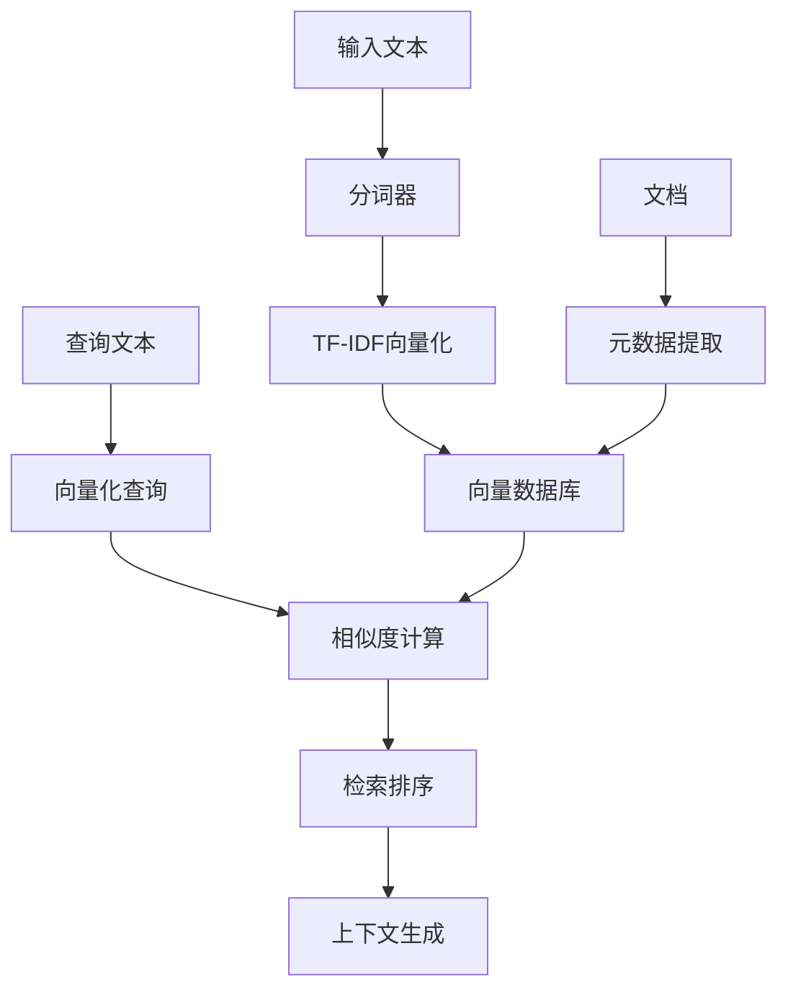

# RAG与向量数据简单实现

## 概述

这是一个从零实现的RAG（检索增强生成）与向量数据处理系统，演示了现代AI应用中的核心概念：文本向量化、相似度计算、语义检索等。本实现使用纯Python，不依赖复杂的第三方库，适合学习和理解RAG系统的工作原理。

## 🌟 核心特性

### 1. 文本向量化
- **分词器**: 支持中英文分词，自动构建词汇表
- **TF-IDF向量化**: 基于词频-逆文档频率的文本表示
- **特征选择**: 自动选择最重要的特征词汇
- **向量归一化**: 支持余弦相似度计算

### 2. 向量相似度计算
- **余弦相似度**: 最常用的文本相似度计算方法
- **欧氏距离**: 向量间的几何距离
- **曼哈顿距离**: L1距离计算
- **相似度阈值**: 可配置的相似度过滤

### 3. 向量数据库
- **SQLite存储**: 轻量级数据库，支持持久化
- **文档管理**: 增删改查文档及其向量
- **元数据支持**: 为文档添加分类、难度等元信息
- **时间戳记录**: 记录文档创建时间

### 4. RAG检索系统
- **语义检索**: 基于向量相似度的智能检索
- **排序算法**: 按相似度对检索结果排序
- **上下文生成**: 自动生成查询相关的上下文
- **长度控制**: 智能截断以适应上下文长度限制

## 🏗️ 系统架构



## 🚀 快速开始

### 基本使用

```python
from 19_rag_vector_demo import RAGSystem

# 创建RAG系统
rag = RAGSystem(vector_dim=256, similarity_threshold=0.05)

# 添加文档
documents = [
    {
        "id": "doc1",
        "content": "Python是一种高级编程语言",
        "metadata": {"category": "编程"}
    }
]
rag.add_documents(documents)

# 检索相关文档
results = rag.search("编程语言特点", top_k=3)
for result in results:
    print(f"相似度: {result.similarity:.3f}")
    print(f"内容: {result.document.content}")
```

### 运行完整演示

```bash
python 19_rag_vector_demo.py
```

选择演示模式：
1. RAG检索增强生成系统演示
2. 向量操作基础演示
3. 完整演示（包含两个部分）

## 📊 系统组件详解

### 1. SimpleTokenizer（分词器）

**功能**：
- 中英文混合分词
- 词汇表构建
- 词汇频率统计

**特点**：
- 支持中文字符级分词
- 自动去除标点符号
- 按词频构建索引

```python
tokenizer = SimpleTokenizer()
tokens = tokenizer.tokenize("机器学习是AI的分支")
# 输出: ['机', '器', '学', '习', '是', 'ai', '的', '分', '支']
```

### 2. TFIDFVectorizer（TF-IDF向量化器）

**核心算法**：
- **TF (词频)**: `tf = 词汇在文档中出现次数 / 文档总词数`
- **IDF (逆文档频率)**: `idf = log(总文档数 / 包含该词的文档数)`
- **TF-IDF分数**: `tfidf = tf × idf`

**工作流程**：
1. 构建词汇表
2. 计算IDF分数
3. 选择重要特征
4. 生成TF-IDF向量

```python
vectorizer = TFIDFVectorizer(max_features=100)
vectors = vectorizer.fit_transform(documents)
```

### 3. VectorSimilarity（向量相似度）

**余弦相似度计算**：
```
cosine_similarity = (A · B) / (||A|| × ||B||)
```

其中：
- `A · B` 是向量点积
- `||A||` 和 `||B||` 是向量的欧几里得范数

**相似度范围**：
- 1.0: 完全相同
- 0.0: 完全无关
- -1.0: 完全相反（在文本中很少出现）

### 4. VectorDatabase（向量数据库）

**数据表结构**：
```sql
CREATE TABLE documents (
    id TEXT PRIMARY KEY,
    content TEXT NOT NULL,
    metadata TEXT,
    embedding TEXT,
    created_at REAL
);
```

**操作接口**：
- `add_document()`: 添加文档
- `get_document()`: 获取文档
- `get_all_documents()`: 获取所有文档
- `delete_document()`: 删除文档
- `count_documents()`: 统计文档数量

### 5. RAGSystem（RAG检索系统）

**检索流程**：
1. 查询向量化
2. 计算相似度
3. 过滤和排序
4. 生成结果

**上下文生成**：
- 根据相似度选择文档
- 智能截断以控制长度
- 添加文档标识和相似度信息

## 💡 核心算法说明

### TF-IDF算法

TF-IDF是一种用于信息检索和文本挖掘的数值统计，反映了词汇对于文档集合中某个文档的重要程度。

**TF（词频）计算**：
```python
tf = word_count_in_document / total_words_in_document
```

**IDF（逆文档频率）计算**：
```python
idf = log(total_documents / documents_containing_word)
```

**最终TF-IDF分数**：
```python
tfidf_score = tf * idf
```

### 余弦相似度算法

余弦相似度通过计算两个向量的余弦值来衡量它们的相似性。

```python
def cosine_similarity(vec1, vec2):
    dot_product = sum(a * b for a, b in zip(vec1, vec2))
    norm1 = sqrt(sum(x * x for x in vec1))
    norm2 = sqrt(sum(x * x for x in vec2))
    return dot_product / (norm1 * norm2)
```

### 检索排序算法

1. **计算相似度**: 对所有文档计算与查询的相似度
2. **阈值过滤**: 过滤掉相似度过低的文档
3. **排序**: 按相似度从高到低排序
4. **截取**: 返回前top_k个结果

## 📚 示例数据集

系统包含10个示例文档，涵盖以下主题：
- Python编程语言
- 机器学习基础
- 深度学习介绍
- 数据科学概览
- Web开发
- 自然语言处理
- 数据库基础
- 云计算介绍
- 软件工程实践
- 网络安全基础

每个文档包含：
- **ID**: 唯一标识符
- **内容**: 主要文本内容
- **元数据**: 分类、难度等信息

## 🔬 演示功能

### 1. 向量操作演示

展示：
- TF-IDF向量化过程
- 词汇表构建
- 特征词汇提取
- 向量相似度矩阵
- 查询相似度计算

### 2. RAG系统演示

功能：
- 批量文档添加
- 预设查询测试
- 交互式查询模式
- 结果排序显示
- 上下文生成

### 3. 交互式查询

支持：
- 实时查询输入
- 多文档检索
- 相似度显示
- 详细结果展示
- 上下文生成

## ⚙️ 配置参数

### RAGSystem参数

```python
rag = RAGSystem(
    vector_dim=256,              # 向量维度
    similarity_threshold=0.05    # 相似度阈值
)
```

### TFIDFVectorizer参数

```python
vectorizer = TFIDFVectorizer(
    max_features=1000           # 最大特征数
)
```

### 检索参数

```python
results = rag.search(
    query="查询文本",
    top_k=5,                    # 返回结果数量
    similarity_method='cosine'   # 相似度计算方法
)
```

## 📈 性能特点

### 优势
- **轻量级**: 无复杂依赖，易于理解和修改
- **完整性**: 包含RAG系统的所有核心组件
- **可扩展**: 模块化设计，易于扩展功能
- **教育性**: 详细注释，适合学习算法原理

### 适用场景
- 学习RAG系统原理
- 小规模文档检索
- 概念验证和原型开发
- 算法教学和演示

### 局限性
- 简单的TF-IDF向量化（可升级为BERT等）
- 基础的相似度计算（可添加更多方法）
- 内存存储限制（可扩展为分布式）

## 🚀 扩展建议

### 1. 向量化改进
```python
# 集成预训练模型
from sentence_transformers import SentenceTransformer
model = SentenceTransformer('paraphrase-multilingual-MiniLM-L12-v2')
```

### 2. 数据库优化
```python
# 使用向量数据库
import faiss
index = faiss.IndexFlatIP(vector_dim)
```

### 3. 检索增强
```python
# 添加重排序
from rank_bm25 import BM25Okapi
bm25 = BM25Okapi(tokenized_corpus)
```

### 4. 生成集成
```python
# 集成大语言模型
def generate_answer(context, query):
    prompt = f"基于以下上下文回答问题：\n{context}\n\n问题：{query}\n答案："
    return call_llm_api(prompt)
```

## 📊 使用示例

### 基础检索
```python
# 创建系统
rag = RAGSystem()

# 添加文档
docs = [{"id": "1", "content": "Python是编程语言"}]
rag.add_documents(docs)

# 检索
results = rag.search("编程语言")
print(f"找到 {len(results)} 个相关文档")
```

### 高级配置
```python
# 自定义配置
rag = RAGSystem(
    vector_dim=512,
    similarity_threshold=0.1
)

# 添加带元数据的文档
docs = [{
    "id": "advanced_doc",
    "content": "深度学习是机器学习的子集",
    "metadata": {
        "category": "AI",
        "difficulty": "高级",
        "tags": ["深度学习", "神经网络"]
    }
}]
```

### 结果处理
```python
results = rag.search("机器学习", top_k=3)
for result in results:
    doc = result.document
    print(f"文档: {doc.id}")
    print(f"相似度: {result.similarity:.4f}")
    print(f"类别: {doc.metadata.get('category')}")
    print(f"内容: {doc.content[:100]}...")
```

## 🎯 学习要点

### 1. 向量化理解
- TF-IDF的数学原理
- 词汇表构建方法
- 特征选择策略

### 2. 相似度计算
- 余弦相似度的几何意义
- 不同距离度量的特点
- 相似度阈值的作用

### 3. 检索策略
- 语义检索vs关键词检索
- 排序算法的重要性
- 结果质量评估

### 4. 系统设计
- 模块化架构的优势
- 数据持久化的必要性
- 性能优化的方向

## 🤔 思考题

1. 如何改进分词器以更好地处理专业术语？
2. TF-IDF之外还有哪些文本向量化方法？
3. 如何评估检索结果的质量？
4. 在大规模数据下如何优化检索性能？
5. 如何结合不同的相似度计算方法？

## 📝 总结

这个RAG与向量数据的实现展示了现代AI应用的核心技术。通过理解和实践这些基础概念，可以为构建更复杂的AI系统打下坚实基础。系统虽然简单，但包含了完整的工作流程，是学习RAG技术的绝佳起点。

---

*这个实现专注于教育价值和算法理解，为进一步学习更高级的RAG系统（如使用BERT、GPT等）提供了基础。*