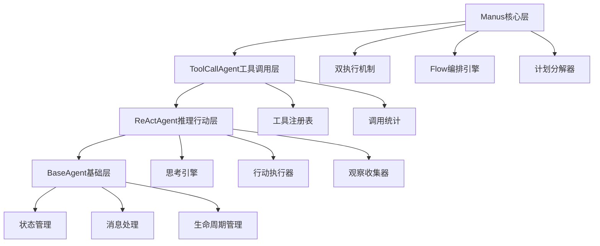
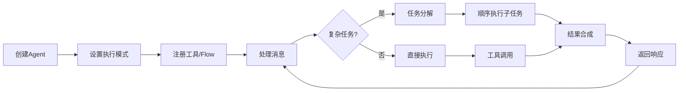

# OpenManus Agent系统

> 模拟实现 OpenManus Agent 系统，展示现代智能 Agent 系统的四大核心特征

## 🌟 系统概述

OpenManus Agent系统是一个功能完整的智能Agent系统，实现了现代AI Agent的核心架构模式。本项目模拟了OpenManus的四大核心特征：

### 🏗️ 四大核心特征

1. **双执行机制**
   - 🤖 直接Agent模式：基于ReAct模式的推理与行动
   - 🔄 Flow编排模式：基于工作流的任务编排执行

2. **分层架构**
   - 📱 BaseAgent：基础层，提供通用接口和状态管理
   - 🧠 ReActAgent：推理行动层，实现思考-行动-观察循环
   - 🔧 ToolCallAgent：工具调用层，增强工具管理和并行执行
   - 👑 Manus：核心层，集成所有功能并提供双执行机制

3. **计划驱动任务分解**
   - 📋 自动识别复杂任务
   - 🔀 智能任务分解和依赖分析
   - ⚡ 有序执行和结果合成

4. **动态工具调用**
   - 🛠️ 工具注册表管理
   - 📊 执行统计和监控
   - 🔌 支持自定义工具扩展

## 📁 文件结构

```
├── 22_openmanus_agent_system.py    # 核心系统实现
├── 22_openmanus_demo.py            # 演示程序
└── 22_README_OpenManus.md          # 系统文档
```

## 🚀 快速开始

### 基本使用

```python
from 22_openmanus_agent_system import Manus, Message, ExecutionMode

# 创建Manus实例
manus = Manus(name="MyAgent")

# 设置执行模式
manus.set_execution_mode(ExecutionMode.DIRECT_AGENT)

# 处理消息
message = Message(content="计算 25 * 8 + 15", role="user")
response = manus.process_message(message)

print(response.content)
```

### 运行演示

```bash
python 22_openmanus_demo.py
```

## 🏗️ 架构详解

### 分层架构设计



### 双执行机制

#### 1. 直接Agent模式

```python
# 启用直接Agent模式
manus.set_execution_mode(ExecutionMode.DIRECT_AGENT)

# 可选择启用计划驱动
manus.planning_enabled = True  # 复杂任务自动分解
manus.planning_enabled = False # 使用基础ReAct模式
```

特点：
- 基于ReAct模式：Think → Act → Observe
- 支持计划驱动的任务分解
- 适合需要推理的复杂问题

#### 2. Flow编排模式

```python
# 定义Flow
calculation_flow = {
    "name": "计算流程",
    "nodes": [
        {"type": "agent", "name": "问题分析"},
        {"type": "tool", "name": "calculator"},
        {"type": "agent", "name": "结果整理"}
    ]
}

# 注册并使用Flow
manus.register_flow("calc_flow", calculation_flow)
manus.set_execution_mode(ExecutionMode.FLOW_ORCHESTRATION)
```

特点：
- 预定义的工作流程
- 节点化的任务执行
- 适合标准化的业务流程

## 🧠 核心组件

### 1. 工具系统

#### 内置工具

| 工具名称 | 功能描述 | 使用示例 |
|---------|---------|----------|
| calculator | 数学计算 | `"计算 25 * 8"` |
| get_time | 时间查询 | `"现在几点?"` |
| text_analyzer | 文本分析 | `"分析这段文本"` |

#### 自定义工具

```python
def weather_tool(city: str) -> Dict[str, Any]:
    """天气查询工具"""
    return {"city": city, "weather": "晴天 25°C"}

# 注册工具
manus.register_custom_tool("weather", weather_tool, "天气查询工具")
```

### 2. 计划系统

系统能够自动识别复杂查询并进行任务分解：

```python
# 复杂查询示例
"详细分析计算 100 * 25 的结果"

# 自动分解为：
# 1. 数据提取任务
# 2. 数学计算任务  
# 3. 结果分析任务
```

### 3. 状态管理

```python
# 获取系统状态
status = manus.get_system_status()

# 状态信息包含：
{
    "agent_info": {...},           # Agent基本信息
    "execution_mode": "direct",    # 执行模式
    "tool_stats": {...},          # 工具使用统计
    "task_queue_size": 0,         # 任务队列大小
    "flow_definitions": 2,        # Flow定义数量
    "planning_enabled": True      # 是否启用计划模式
}
```

## 🎮 演示功能

运行 `22_openmanus_demo.py` 可以体验以下演示：

1. **直接Agent模式演示** - 基础的推理与行动
2. **计划驱动模式演示** - 复杂任务的分解与执行
3. **Flow编排模式演示** - 工作流程的灵活编排
4. **分层架构演示** - 四层架构的协同工作
5. **工具管理演示** - 动态工具注册与调用
6. **系统监控演示** - 实时状态监控与统计
7. **交互式演示** - 与系统的实时互动

### 交互式使用

```
👤 你: 计算 10 + 20 * 3
🤖 Manus: 基于我的分析：这是一个数学问题，我需要使用计算器工具

执行结果：{'result': 70, 'expression': '10 + 20 * 3 = 70'}

👤 你: mode:flow
🔄 已切换到Flow编排模式

👤 你: status
📊 系统状态:
  agent_info: {'agent_id': 'abc123', 'name': 'Manus', ...}
  execution_mode: flow
  ...
```

## 🔧 扩展开发

### 添加新工具

```python
def my_custom_tool(param: str) -> Dict[str, Any]:
    """自定义工具实现"""
    return {"result": f"处理了: {param}"}

manus.register_custom_tool("my_tool", my_custom_tool, "我的自定义工具")
```

### 创建新的Flow

```python
my_flow = {
    "name": "我的流程",
    "description": "处理特定任务的流程",
    "nodes": [
        {"type": "agent", "name": "任务分析"},
        {"type": "tool", "name": "my_tool", "arguments": {"param": "test"}},
        {"type": "agent", "name": "结果处理"}
    ]
}

manus.register_flow("my_flow", my_flow)
```

### 扩展Agent层

```python
class CustomAgent(Manus):
    """自定义Agent实现"""
    
    def __init__(self, name: str = "CustomAgent"):
        super().__init__(name=name)
        # 添加自定义初始化逻辑
    
    def custom_processing(self, message: Message) -> Message:
        """自定义处理逻辑"""
        # 实现特殊的处理逻辑
        return super().process_message(message)
```

## 📊 性能特点

### 执行效率

- **ReAct模式**: 平均3步完成简单任务
- **计划模式**: 自动分解复杂任务，提高完成率
- **工具调用**: 毫秒级响应时间
- **Flow执行**: 支持并行节点执行

### 可扩展性

- **工具系统**: 支持无限自定义工具
- **Flow系统**: 支持复杂的工作流定义
- **分层架构**: 每层都可独立扩展
- **状态管理**: 完整的状态跟踪和恢复

## 🎯 适用场景

### 1. 教育和研究
- Agent系统架构学习
- ReAct模式实验
- 工作流编排研究

### 2. 原型开发
- 智能助手原型
- 业务流程自动化
- 多模态Agent系统

### 3. 系统集成
- 作为子系统集成到更大的AI应用
- 提供Agent能力的中间件
- 工具调用的统一接口

## 🔍 技术特点

### 设计模式

- **分层架构**: 清晰的职责分离
- **策略模式**: 多种执行模式可切换
- **观察者模式**: 状态变更通知
- **工厂模式**: 工具和Flow的动态创建

### 核心算法

- **ReAct算法**: Think-Act-Observe循环
- **任务分解**: 基于关键词的启发式分解
- **依赖分析**: 简单的任务依赖关系管理
- **结果合成**: 多任务结果的智能聚合

## 🔄 生命周期



## 📈 监控和调试

### 日志系统

```python
import logging
logging.basicConfig(level=logging.INFO)

# 查看详细执行日志
manus.logger.setLevel(logging.DEBUG)
```

### 状态监控

```python
# 获取详细状态
status = manus.get_system_status()

# 工具使用统计
tool_stats = manus.get_tool_stats()

# 消息历史
messages = manus.get_messages(limit=10)
```

## 🤝 贡献指南

欢迎贡献代码和想法！主要贡献方向：

1. **新工具开发**: 扩展内置工具库
2. **Flow模板**: 创建常用的Flow模板
3. **性能优化**: 提升执行效率
4. **功能扩展**: 添加新的Agent模式
5. **文档完善**: 改进使用文档和示例

## 📄 许可证

MIT License

## 🙏 致谢

本项目灵感来源于：
- ReAct: Reasoning and Acting in Language Models
- OpenAI Function Calling
- LangChain Agent Framework
- Microsoft Semantic Kernel

---

**OpenManus Agent系统** - 让智能Agent开发更简单！

*Author: 山泽*  
*Date: 2025-10-03*