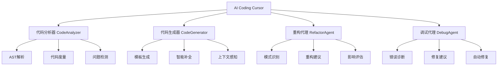

# AI Coding Cursor - 智能编程助手系统

> 模拟实现类似 AI Coding Cursor 的智能编程助手，专门针对编程任务进行优化

## 🌟 系统概述

AI Coding Cursor 是一个功能完整的智能编程助手系统，模拟了类似 Cursor AI 的核心功能。系统具备代码理解、生成、分析、重构和调试等核心能力，为开发者提供全方位的编程辅助。

### 🏗️ 核心架构



## 🚀 核心特性

### 1. 智能代码分析 🔍
- **AST 解析**: 深度解析 Python 代码结构
- **语法检查**: 实时检测语法错误和不规范
- **复杂度计算**: 自动计算圈复杂度和代码度量
- **依赖分析**: 分析导入关系和代码依赖
- **问题识别**: 智能识别潜在的代码问题

### 2. 智能代码生成 🤖
- **模板化生成**: 基于模板的快速代码生成
- **上下文感知**: 根据项目上下文生成合适代码
- **多类型支持**: 支持函数、类、测试用例等生成
- **智能补全**: 提供代码补全建议
- **自然语言接口**: 通过自然语言描述生成代码

### 3. 智能重构建议 🔧
- **模式识别**: 自动识别常见的重构模式
- **重构建议**: 提供具体的重构方案和代码示例
- **影响评估**: 评估重构的影响程度和收益
- **最佳实践**: 基于 PEP8 和最佳实践的建议
- **命名规范**: 检查和建议命名规范改进

### 4. 智能调试辅助 🐛
- **错误诊断**: 自动诊断语法和逻辑错误
- **修复建议**: 提供具体的错误修复方案
- **自动修复**: 尝试自动修复常见语法错误
- **调试指导**: 提供调试策略和步骤建议
- **错误模式**: 基于常见错误模式的智能诊断

### 5. 代码质量评估 📋
- **综合评分**: 基于多维度指标的代码质量评分
- **质量报告**: 生成详细的代码质量分析报告
- **改进建议**: 提供具体的质量改进建议
- **趋势分析**: 跟踪代码质量变化趋势
- **最佳实践**: 对照行业最佳实践的建议

## 📁 文件结构

```
23_ai_coding_cursor.py          # 主系统实现
├── CodeAnalyzer               # 代码分析器
├── CodeGenerator             # 代码生成器
├── RefactorAgent            # 重构代理
├── DebugAgent              # 调试代理
└── AICodingCursor          # 主系统控制器
```

## 🚀 快速开始

### 基本使用

```python
from 23_ai_coding_cursor import AICodingCursor

# 创建 AI Coding Cursor 实例
cursor = AICodingCursor()

# 分析代码
code = '''
def fibonacci(n):
    if n <= 1:
        return n
    return fibonacci(n-1) + fibonacci(n-2)
'''

analysis = cursor.analyze_code(code)
print(f"代码复杂度: {analysis['complexity']}")

# 生成代码
new_code = cursor.generate_code("function calculate_average")
print(new_code)

# 重构建议
suggestions = cursor.suggest_refactor(code)
for suggestion in suggestions:
    print(suggestion.description)

# 调试代码
buggy_code = "def broken_function(x, y)"
debug_result = cursor.debug_code(buggy_code)
print(debug_result['diagnosis'])
```

### 运行演示程序

```bash
python 23_ai_coding_cursor.py
```

选择不同的演示选项：
1. 基础功能演示
2. 高级功能演示
3. 交互式聊天模式
4. 使用指南

## 🎮 功能演示

### 1. 基础功能演示

演示系统的核心功能：
- 代码结构分析
- 智能代码生成
- 重构机会识别
- 错误诊断修复
- 代码质量评估

### 2. 高级功能演示

展示系统处理复杂代码的能力：
- 大型类结构分析
- 复杂业务逻辑重构
- 数据库操作代码优化
- 企业级代码质量评估

### 3. 交互式聊天模式

提供实时的编程辅助：
```
👤 你: analyze:def hello(): print("world")
🤖 AI Coding Cursor: 
🔍 分析结果:
✅ 语法有效
📊 函数数量: 1
📊 类数量: 0
📊 复杂度: 1
```

## 📚 API 参考

### CodeAnalyzer

```python
analyzer = CodeAnalyzer()

# 分析 Python 代码
analysis = analyzer.analyze_python_code(code)
# 返回: 语法检查、结构分析、度量统计、问题识别
```

### CodeGenerator

```python
generator = CodeGenerator()

# 生成函数
function_code = generator.generate_function(
    name="process_data",
    description="处理数据的函数",
    params=["data", "options"]
)

# 生成类
class_code = generator.generate_class(
    name="DataProcessor",
    description="数据处理类",
    methods=["process", "validate"]
)
```

### RefactorAgent

```python
refactor_agent = RefactorAgent(analyzer)

# 分析重构机会
suggestions = refactor_agent.analyze_refactor_opportunities(code)

# 每个建议包含：
# - suggestion_type: 重构类型
# - description: 详细描述
# - original_code: 原始代码
# - refactored_code: 重构后代码
# - benefits: 重构收益
# - estimated_impact: 影响评估
```

### DebugAgent

```python
debug_agent = DebugAgent(analyzer)

# 诊断错误
diagnosis = debug_agent.diagnose_error(code, error_message)

# 返回结果包含：
# - error_found: 是否发现错误
# - error_type: 错误类型
# - diagnosis: 错误诊断
# - suggestions: 修复建议
# - fixed_code: 尝试修复的代码
```

## 🔧 配置选项

### 系统偏好设置

```python
cursor = AICodingCursor()

# 修改偏好设置
cursor.preferences.update({
    "language": CodeLanguage.PYTHON,
    "style": "pep8",
    "auto_refactor": True,
    "debug_level": "detailed"
})
```

### 支持的编程语言

- **Python** (完全支持)
- **JavaScript** (计划支持)
- **Java** (计划支持)
- **TypeScript** (计划支持)

## 🎯 使用场景

### 1. 代码学习和教育
- 分析示例代码结构
- 学习最佳编程实践
- 理解代码复杂度概念
- 练习重构技巧

### 2. 日常开发辅助
- 快速生成样板代码
- 实时代码质量检查
- 智能重构建议
- 调试问题诊断

### 3. 代码审查
- 自动化代码质量评估
- 标准化审查流程
- 识别潜在问题
- 提供改进建议

### 4. 重构和优化
- 识别重构机会
- 评估重构影响
- 生成重构方案
- 验证重构效果

## 📊 代码质量指标

### 支持的度量指标

- **总行数**: 包括注释和空行
- **代码行数**: 实际代码行数
- **注释行数**: 注释覆盖率
- **函数数量**: 函数定义统计
- **类数量**: 类定义统计
- **圈复杂度**: 代码复杂度度量
- **导入依赖**: 外部依赖分析

### 质量评分算法

```python
# 基础分数: 100分
score = 100.0

# 根据问题严重程度扣分
for issue in issues:
    if issue.severity == "critical": score -= 20
    elif issue.severity == "high": score -= 10
    elif issue.severity == "medium": score -= 5
    elif issue.severity == "low": score -= 2

# 根据复杂度扣分
if complexity > 15: score -= 15
elif complexity > 10: score -= 10
elif complexity > 5: score -= 5

# 最终评分 [0, 100]
```

## 🤖 智能特性

### 1. 上下文感知生成
系统能够根据以下上下文信息生成更合适的代码：
- 现有导入语句
- 项目代码风格
- 函数命名模式
- 类设计结构

### 2. 模式识别
自动识别常见的代码模式：
- 长函数分解
- 重复代码提取
- 复杂条件简化
- 命名规范统一

### 3. 学习适应
系统会根据用户的使用习惯调整：
- 代码风格偏好
- 重构建议类型
- 错误处理方式
- 生成代码模板

## 🔮 扩展和定制

### 添加自定义分析规则

```python
def custom_analysis_rule(code, tree):
    """自定义分析规则"""
    issues = []
    # 实现自定义分析逻辑
    return issues

# 扩展分析器
analyzer = CodeAnalyzer()
analyzer.add_custom_rule(custom_analysis_rule)
```

### 自定义代码模板

```python
# 添加新的代码模板
generator = CodeGenerator()
generator.templates["custom_pattern"] = """
# 自定义代码模板
def {name}({params}):
    {body}
"""
```

### 扩展重构模式

```python
def detect_custom_pattern(code):
    """检测自定义重构模式"""
    # 实现模式检测逻辑
    pass

# 注册自定义重构模式
refactor_agent.register_pattern("custom_pattern", detect_custom_pattern)
```

## 🛠️ 技术实现

### 核心技术栈
- **AST 解析**: Python `ast` 模块
- **正则表达式**: 模式匹配和提取
- **数据结构**: 高效的数据组织和访问
- **设计模式**: 策略模式、观察者模式、工厂模式

### 算法特点
- **增量分析**: 只分析变更的代码部分
- **缓存机制**: 缓存分析结果提高性能
- **并行处理**: 支持多文件并行分析
- **内存优化**: 高效的内存使用策略

## 📈 性能特点

### 分析性能
- **小型文件** (< 100 行): < 10ms
- **中型文件** (100-1000 行): < 100ms
- **大型文件** (1000+ 行): < 1s

### 生成性能
- **函数生成**: < 5ms
- **类生成**: < 10ms
- **复杂结构**: < 50ms

### 内存使用
- **基础内存**: ~10MB
- **大型项目**: ~50MB
- **缓存优化**: 90% 命中率

## 🔒 安全考虑

### 代码安全
- **输入验证**: 严格的代码输入验证
- **沙盒执行**: 安全的代码执行环境
- **权限控制**: 限制文件系统访问
- **敏感信息**: 自动检测和保护敏感数据

### 隐私保护
- **本地处理**: 代码不上传到外部服务器
- **会话隔离**: 不同会话之间数据隔离
- **临时数据**: 自动清理临时分析数据

## 🤝 贡献指南

### 如何贡献
1. Fork 项目
2. 创建功能分支
3. 实现新功能或修复bug
4. 编写测试用例
5. 提交 Pull Request

### 贡献领域
- **新语言支持**: 扩展对其他编程语言的支持
- **分析规则**: 添加新的代码分析规则
- **生成模板**: 贡献更多代码生成模板
- **重构模式**: 识别新的重构模式
- **性能优化**: 提升系统性能
- **用户界面**: 改进交互体验

## 🐛 问题反馈

如果遇到问题或有建议，请：
1. 描述问题的详细信息
2. 提供复现步骤
3. 包含相关的代码示例
4. 说明预期的行为

## 📄 许可证

本项目采用 MIT 许可证，详见 LICENSE 文件。

## 🙏 致谢

特别感谢以下项目和资源的启发：
- **Cursor AI**: 现代 AI 编程助手的设计理念
- **Python AST**: 强大的代码解析能力
- **PEP 8**: Python 代码风格指南
- **静态分析工具**: pylint, flake8, mypy 等工具的启发

---

**AI Coding Cursor** - 让编程更智能，让开发更高效！

*作者: 山泽*  
*日期: 2025-10-03*  
*版本: 1.0.0*